# micropython-micro-gui

This is a lightweight, portable, MicroPython GUI library for displays with
drivers subclassed from `framebuf`. It allows input via pushbuttons or via a
switch joystick. Written in Python it runs under a standard MicroPython
firmware build.

It is larger and more complex than `nano-gui` owing to the support for input.
It enables switching between screens and launching modal windows. In addition
to `nano-gui` widgets it supports listboxes, dropdown lists, various means of
entering or displaying floating point values, and other widgets.

It is compatible with all display drivers for
[nano-gui](https://github.com/peterhinch/micropython-nano-gui) so is portable
to a wide range of displays. It is also portable between hosts.

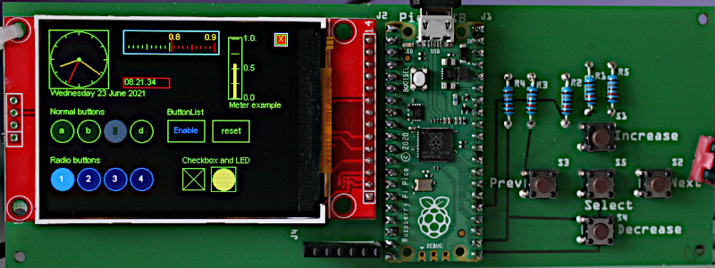

# Rationale

Touch GUI's have many advantages, however they have drawbacks, principally cost
and the need for calibration. Note that the latter does not apply to the
[official LCD160cr](https://store.micropython.org/product/LCD160CRv1.1H).
Another problem is that there are a number of types of touch controller,
magnifying the difficulty of writing a portable GUI.

Pushbutton input works well and yields astonishingly low cost solutions. A
network-connected board with a 135x240 color display can be built for under £20
($20?) using the
[TTGO T-Display](http://www.lilygo.cn/prod_view.aspx?TypeId=50044&Id=1126). The
test board shown above has a 320x240 display with a Pi Pico with component cost
well under £20.

The following are similar GUI repos with differing objectives.
 * [nano-gui](https://github.com/peterhinch/micropython-nano-gui) Extremely low
 RAM usage but display-only with no provision for input.
 * [LCD160cr](https://github.com/peterhinch/micropython-lcd160cr-gui) Touch GUI
 for the official display.
 * [RA8875](https://github.com/peterhinch/micropython_ra8875) Touch GUI for
 displays with RA8875 controller. Supports large displays, e.g. from Adafruit.
 * [SSD1963](https://github.com/peterhinch/micropython-tft-gui) Touch GUI for
 displays based on SSD1963 and XPT2046. High performance on large displays due
 to the parallel interface. Specific to STM hosts.

[LVGL](https://lvgl.io/) is a pretty icon-based GUI library. It is written in C
with MicroPython bindings; consequently it requires the build system for your
target and a C device driver (unless you can acquire a suitable binary).

# Project status

Code has been tested on ESP32 and Pi Pico. The API shuld be stable. I'm not
aware of any bugs but code is new and issues are likely. This document is
likely to have errors, typos and omissions. It is under review.

# 0. Contents

**TODO** Add sub-headings

1. [Basic concepts](./README.md#1-basic-concepts) Including installation and test.  
2. [Usage](./README.md#2-usage) Application design.  
3. [The ssd and display objects](./README.md#3-the-ssd-and-display-objects)  
4. [Screen class](./README.md#4-screen-class) Full screen window.  
5. [Window class](./README.md#5-window-class)  
6. [Label widget](./README.md#6-label-widget) Single line text display.  
7. [LED widget](./README.md#7-led-widget) Display Boolean values.  
8. [Checkbox widget](./README.md#8-checkbox-widget) Enter Boolean values.  
9. [Button and CloseButton widgets](./README.md#9-button-and-closebutton-widgets) Pushbutton emulation.  
10. [ButtonList object](./README.md#10-buttonlist-object) Pushbuttons with multiple states.  
11. [RadioButtons object](./README.md#11-radiobuttons-object) One-of-N pushbuttons.  
12. [Listbox widget](./README.md#12-listbox-widget)  
13. [Dropdown widget](./README.md#13-dropdown-widget) Dropdown lists.  
14. [DialogBox class](./README.md#14-dialogbox-class) Pop-up modal dialog boxes.  
15. [Textbox widget](./README.md#15-textbox-widget) Scrolling text display.  
16. [Meter widget](./README.md#16-meter-widget) Display floats on an analog meter.  
17. [Slider and HorizSlider widgets](./README.md#17-slider-and-horizslider-widgets) Linear potentiometer float data entry and display  
18. [Scale widget](./README.md#18-scale-widget) High precision float entry and display.  
19. [ScaleLog widget](./README.md#19-scalelog-widget) Wide dynamic range float entry and display.  
20. [Dial widget](./README.md#20-dial-widget) Display multiple vectors.  
21. [Knob widget](./README.md#21-knob-widget) Rotary potentiometer float entry.  
22. [Graph plotting](./README.md#22-graph-plotting) Widgets for Cartesian and polar graphs.  
[Appendix 1 Application design](./README.md#appendix-1-application-design)  

# 1. Basic concepts

Internally `micro-gui` uses `uasyncio`. It presents a conventional callback
based interface; knowledge of `uasyncio` is not required for its use. Display
refresh is handled automatically. As in nano-gui, widgets are drawn using
graphics primitives rather than icons. This makes them efficiently scalable and
minimises RAM usage compared to icon-based graphics. It also facilitates the
provision of extra visual information. For example the color of all or part of
a widget may be changed programmatically, for example to highlight an overrange
condition.

## 1.1 Coordinates

These are defined as `row` and `col` values where `row==0` and `col==0`
corresponds to the top left most pixel. Rows increase downwards and columns
increase to the right. The graph plotting widget uses normal mathematical
conventions within graphs.

## 1.2 Screen, Window and Widget objects

A `Screen` is a window which occupies the entire display. A `Screen` can
overlay another, replacing all its contents. When closed, the `Screen` below is
re-displayed.

A `Window` is a subclass of `Screen` but is smaller, with size and location
attributes. It can overlay part of an underlying `Screen` and is typically used
for modal dialog boxes.

A `Widget` is an object capable of displaying data. Some are also capable of
data input: such a widget is defined as `active`. A `passive` widget can only
display data. An `active` widget can acquire `focus`. The widget with `focus`
is able to respond to user input. See [navigation](./README.md#14-navigation).
`Widget` objects have dimensions defined as `height` and `width`. The space
requred by them exceeds these dimensions by two pixels all round. This is
because `micro-gui` displays a white border to show which object currently has
`focus`. Thus to place a `Widget` at the extreme top left, `row` and `col`
values should be 2.

## 1.3 Fonts

Python font files are in the `gui/fonts` directory. The easiest way to conserve
RAM is to freeze them which is highly recommended. In doing so the directory
structure must be maintained.

To create alternatives, Python fonts may be generated from industry standard
font files with
[font_to_py.py](https://github.com/peterhinch/micropython-font-to-py.git). The
`-x` option for horizontal mapping must be specified. If fixed pitch rendering
is required `-f` is also required. Supplied examples are:

 * `arial10.py` Variable pitch Arial. 10 pixels high.
 * `arial35.py` Arial 35 high.
 * `arial_50.py` Arial 50 high.
 * `courier20.py` Fixed pitch Courier, 20 high.
 * `font6.py` FreeSans 14 high.
 * `font10.py` FreeSans 17 high.
 * `freesans20.py` FreeSans 20 high.

## 1.4 Navigation

The GUI requires from 2 to 5 pushbuttons for control. These are:
 1. `Next` Move to the next widget.
 2. `Select` Operate the currently selected widget.
 3. `Prev` Move to the previous widget.
 4. `Increase` Move within the widget (i.e. adjust its value).
 5. `Decrease` Move within the widget.

Many widgets such as `Pushbutton` or `Checkbox` objects require only the
`Select` button to operate: it is possible to design an interface with a subset
of `micro-gui` widgets which requires only the first two buttons.

Widgets such as `Listbox` objects, dropdown lists (`Dropdown`), and those for
floating point data entry require the `Increase` and `Decrease` buttons to
select a data item or to adjust the linear value. This is discussed in
[Floating Point Widgets](./README.md#112-floating-point-widgets).

The currently selected `Widget` is identified by a white border: the `focus`
moves between widgets via `Next` and `Prev`. Only `active` `Widget` instances
(those that can accept input) can receive the `focus`.  Widgets are defined as
`active` or `passive` in the constructor, and this status cannot be changed. In
some cases the state can be specified as a constructor arg. An `active` widget
can be disabled and re-enabled at runtime. A disabled `active` widget is shown
"greyed-out" and, until re-enabled, cannot accept the focus.

## 1.5 Hardware definition

A file `hardware_setup.py` must exist in the GUI root directory. This defines
the connections to the display, the display driver, and pins used for the
pushbuttons. Example files may be found in the `setup_examples` directory. The
following is a typical example for a Raspberry Pi Pico driving an ILI9341
display:

```python
from machine import Pin, SPI, freq
import gc

from drivers.ili93xx.ili9341 import ILI9341 as SSD
freq(250_000_000)  # RP2 overclock
# Create and export an SSD instance
pdc = Pin(8, Pin.OUT, value=0)  # Arbitrary pins
prst = Pin(9, Pin.OUT, value=1)
pcs = Pin(10, Pin.OUT, value=1)
spi = SPI(0, baudrate=30_000_000)
gc.collect()  # Precaution before instantiating framebuf
ssd = SSD(spi, pcs, pdc, prst, usd=True)

from gui.core.ugui import Display, setup
# Create and export a Display instance
# Define control buttons
nxt = Pin(19, Pin.IN, Pin.PULL_UP)  # Move to next control
sel = Pin(16, Pin.IN, Pin.PULL_UP)  # Operate current control
prev = Pin(18, Pin.IN, Pin.PULL_UP)  # Move to previous control
increase = Pin(20, Pin.IN, Pin.PULL_UP)  # Increase control's value
decrease = Pin(17, Pin.IN, Pin.PULL_UP)  # Decrease control's value
display = Display(ssd, nxt, sel, prev, increase, decrease)
```

Display drivers are documented
[here](https://github.com/peterhinch/micropython-nano-gui/blob/master/DRIVERS.md).

## 1.6 Quick hardware check

The following may be pasted at the REPL to verify correct connection to the
display. It also confirms that `hardware_setup.py` is specifying a suitable
display driver.
```python
from hardware_setup import ssd  # Create a display instance
from gui.core.colors import *
ssd.fill(0)
ssd.line(0, 0, ssd.width - 1, ssd.height - 1, GREEN)  # Green diagonal corner-to-corner
ssd.rect(0, 0, 15, 15, RED)  # Red square at top left
ssd.rect(ssd.width -15, ssd.height -15, 15, 15, BLUE)  # Blue square at bottom right
ssd.show()
```

## 1.7 Installation

The easy way to start is to use `mpremote` which allows a directory on your PC
to be mounted on the host. In this way the filesystem on the host is left
unchanged. This is at some cost in loading speed, especially on ESP32. If
adopting this approach, you will need to ensure the `hardware_setup.py` file on
the PC matches your hardware. Install `mpremote` with
```bash
$ pip3 install mpremote
```
Clone the repo to your PC with
```bash
$ git clone https://github.com/peterhinch/micropython-micro-gui
$ cd micropython-micro-gui
```
Edit `hardware_setup.py` then run:
```bash
$ mpremote mount .
```
This should provide a REPL. Run the minimal demo:
```python
>>> import gui.demos.simple
```
If installing to the device's filesystem it is necessary to maintain the
directory structure. The `drivers` and `gui` directories (with subdirectories
and contents) should be copied, along with `hardware_setup.py`. Filesystem
space may be conserved by copying only the display driver in use. Unused
widgets, fonts and demos can also be trimmed, but directory structure must be
kept.

There is scope for speeding loading and saving RAM by using frozen bytecode.
Once again, directory structure must be maintained.

## 1.8 Performance and hardware notes

The largest supported display is a 320x240 ILI9341 unit. On a Pi Pico with no
use of frozen bytecode the demos run with about 74K of free RAM. Substantial
improvements could be achieved using frozen bytecode.

Snappy navigation benefits from several approaches:
 1. Clocking the SPI bus as fast as possible.
 2. Clocking the host fast (`machine.freq`).
 3. Device driver support for `uasyncio`. Currently this exists on ILI9341 and
    ST7789 (e.g. TTGO T-Display). I intend to extend this to other drivers.

The consequence of inadequate speed is that brief button presses can be missed.
This is because display update blocks for tens of milliseconds, during which
time the pushbuttons are not polled. Blocking is much reduced by item 3 above.

On the TTGO T-Display I found it necessary to use physical pullup resistors on
the pushbutton GPIO lines. According to the
[ESP32 gurus](https://randomnerdtutorials.com/esp32-pinout-reference-gpios/)
pins 36-39 do not have pullup support.

On a Pyboard 1.1 with 320x240 ili9341 display it was necessary to use frozen
bytecode: in this configuration running the "various" demo there was 29K of
free RAM. Note that, at 37.5KiB, this display is the worst-case in terms of
RAM usage. A smaller display or a Pyboard D would offer more headroom.

## 1.9 Firmware and dependencies

Firmware should be V1.15 or later. The source tree includes all dependencies.
These are listed to enable users to check for newer versions:

 * [writer.py](https://github.com/peterhinch/micropython-font-to-py/blob/master/writer/writer.py)
 Provides text rendering of Python font files.
 * [SSD1306 driver](https://github.com/micropython/micropython/blob/master/drivers/display/ssd1306.py).
 A copy of the official driver for OLED displays using the SSD1306 chip is
 provided. The link is to the official file.
 * [Synchronisation primitives](https://github.com/peterhinch/micropython-async/tree/master/v3/primitives).
 The link is to my `uasyncio` support repo.
 * [PCD8544/Nokia 5110](https://github.com/mcauser/micropython-pcd8544.git).
 Displays based on the Nokia 5110 (PCD8544 chip) require this driver. It is not
 provided in this repo. The link is to its source.

## 1.10 Supported hosts and displays

Development was done using a Raspberry Pi Pico connected to a cheap ILI9341
320x240 display. I have also tested a TTGO T-Display (an ESP32 host) and a
Pyboard. Code is written with portability as an aim, but MicroPython configs
vary between platforms and I can't guarantee that every widget will work on
every platform. For example, some use the `cmath` module which may be absent on
some builds.

Supported displays are as per
[the nano-gui list](https://github.com/peterhinch/micropython-nano-gui/blob/master/README.md#12-description).
In practice usage with ePaper displays is questionable because of their slow
refresh times. I haven't tested these, or the Sharp displays.

Display drivers are documented [here](https://github.com/peterhinch/micropython-nano-gui/blob/master/DRIVERS.md).

## 1.11 Files

Display drivers may be found in the `drivers` directory. These are copies of
those in `nano-gui`, included for convenience.

The system is organised as a Python package with the root being `gui`. Core
files in `gui/core` are:  
 * `colors.py` Constants including colors and shapes.
 * `ugui.py` The main GUI code.
 * `writer.py` Supports the `Writer` and `CWriter` classes.

The `gui/primitives` directory contains the following files:  
 * `switch.py` Interface to physical pushbuttons.
 * `delay_ms.py` A software triggerable timer.

The `gui/demos` directory contains a variety of demos and tests, some of which
require a large (320x240) display. Demos are run by issuing (for example):
```python
>>> import gui.demos.simple
```
 * `simple.py` Minimal demo discussed below.
 * `active.py` Demonstrates `active` controls providing floating point input.
 * `plot.py` Graph plotting.
 * `screens.py` Listbox, dropdown and dialog boxes.
 * `tbox.py` Text boxes and user-controlled scrolling.
 * `various.py` Assorted widgets including the different types of pushbutton.
 * `vtest.py` Clock and compass styles of vector display.

## 1.12 Floating Point Widgets

The challenge is to devise a way, with just two pushbuttons, of adjusting a
data value which may have an extremely large dynamic range. This is the ratio
of the data value's total range to the smallest adjustment that can be made.
The mechanism as currently implemented enables a precision of 0.05%.

Floating point widgets respond to a brief press of the `increase` or `decrease`
buttons by adjusting the value by a small amount. A continued press causes the
value to be repeatedly adjusted, with the amount of the adjustment increasing
with time. This enables the entire range of the control to be accessed quickly,
while allowing small changes of 0.5%. This works well. In many cases the level
of precision will suffice.

Fine adjustments may be achieved by pressing the `select` button for at least
one second. The GUI will respond by changing the border color from white
(i.e. has focus) to yellow. In this mode a brief press of `increase` or
`decrease` will have a reduced effect (0.05%). The fine mode may be cancelled
by pressing `select` or by moving the focus to another control.

In the case of slider and knob controls the precision of fine mode exceeds that
of the visual appearance of the widget: fine changes can be too small to see.
Options are to use the [Scale widget](./README.md#18-scale-widget) or to have a
linked `Label` showing the widget's exact value.

###### [Contents](./README.md#0-contents)

# 2. Usage

## 2.1 Program structure and operation

The following is a minimal script (found in `gui.demos.simple.py`) which will
run on a minimal system with a small display and two pushbuttons. It provides
two `Button` widgets with "Yes" and "No" legends.

It may be run by issuing at the REPL:
```python
>>> import gui.demos.simple
```

Note that the import of `hardware_setup.py` is the first line of code. This is
because the frame buffer is created here, with a need for a substantial block
of contiguous RAM.
```python
import hardware_setup  # Instantiate display, setup color LUT (if present)
from gui.core.ugui import Screen, ssd

from gui.widgets.label import Label
from gui.widgets.buttons import Button, CloseButton
from gui.core.writer import CWriter

# Font for CWriter
import gui.fonts.arial10 as arial10
from gui.core.colors import *


class BaseScreen(Screen):

    def __init__(self):

        def my_callback(button, arg):
            print('Button pressed', arg)

        super().__init__()
        wri = CWriter(ssd, arial10, GREEN, BLACK, verbose=False)

        col = 2
        row = 2
        Label(wri, row, col, 'Simple Demo')
        row = 20
        Button(wri, row, col, text='Yes', callback=my_callback, args=('Yes',))
        col += 60
        Button(wri, row, col, text='No', callback=my_callback, args=('No',))
        CloseButton(wri)  # Quit the application

def test():
    print('Testing micro-gui...')
    Screen.change(BaseScreen)

test()
```
Note how the `Next` pushbutton moves the focus between the two buttons and the
"X" close button. The focus does not move to the "Simple Demo" widget because
it is not `active`: a `Label` cannot accept user input. Pushing the `Select`
pushbutton while the focus is on a `Pushbutton` causes the callback to run.

Applications start by performing `Screen.change()` to a user-defined `Screen`
object. This must be subclassed from the GUI's `Screen` class. Note that
`Screen.change` accepts a class name, not a class instance.

The user defined `BaseScreen` class constructor instantiates all widgets to be
displayed and typically associates them with callback functions - which may be
bound methods. Screens typically have a `CloseButton` widget. This is a special
`Pushbutton` subclass which displays as an "X" at the top right corner of the
physical display and closes the current screen, showing the one below. If used
on the bottom level `Screen` (as above) it closes the application.

The `wri` instance of `CWriter` associates a widget with a font. Constructors
for all widgets have three mandatory positional args. These are a `CWriter`
instance followed by `row` and `col`. These args are followed by a number of
optional keyword args. These have (hopefully) sensible defaults enabling you to
get started easily.

## 2.2 Callbacks

The interface is event driven. Widgets may have optional callbacks which will
be executed when a given event occurs. Events occur when a widget's properties
are changed programmatically, and also (in the case of `active` widgets) in
response to user input.

A callback function receives positional arguments. The first is a reference to
the object raising the callback. Subsequent arguments are user defined, and are
specified as a tuple or list of items. Callbacks and their argument lists are
optional: a default null function and empty list are provided. Callbacks may
optionally be written as bound methods. This facilitates communication between
widgets.

When writing callbacks take care to ensure that the correct number of arguments
are passed, bearing in mind the first arg described above. An incorrect
argument count results in puzzling tracebacks which appear to implicate the GUI
code. This is because it is the GUI which actually executes the callbacks.

## 2.3 Colors

The file `gui/core/colors.py` defines a set of color constants which may be
used with any display driver. This section describes how to change these or
to create additional colors. Most of the color display drivers define colors
as 8-bit or larger values. For the larger displays 4-bit drivers are provided
with the aim of conserving RAM.

In the 4-bit case colors are assigned to a lookup table (LUT) with 16 entries.
The frame buffer stores 4-bit color values, which are converted to the correct
color depth for the hardware when the display is refreshed. Of the 16 possible
colors 13 are assigned in `gui/core/colors.py`, leaving color numbers 12, 13
and 14 free.

The following code is portable between displays and creates a user defined
color `PALE_YELLOW`.
```python
from gui.core.colors import *  # Imports the create_color function
PALE_YELLOW = create_color(12, 150, 150, 0)  # index, r, g, b
```
If a 4-bit driver is in use, the color `rgb(150, 150, 0)` will be assigned to
"spare" color number 12. Any color number in range `0 <= n <= 15` may be
used, implying that predefined colors may be reassigned. It is recommended
that `BLACK` (0) and `WHITE` (15) are not changed. If an 8-bit or larger driver
is in use, the first `index` arg is ignored and there is no restriction on the
number of colors that may be created.

Regardless of the display driver the `PALE_YELLOW` variable may be used to
refer to the color. An example of custom color definition may be found in
[this nano-gui demo](https://github.com/peterhinch/micropython-nano-gui/blob/4ef0e20da27ef7c0b5c34136dcb372200f0e5e66/gui/demos/color15.py#L92).

### 2.3.1 Monochrome displays

Most widgets work on monochrome displays if color settings are left at default
values. If a color is specified, drivers in this repo will convert it to black
or white depending on its level of saturation. A low level will produce the
background color, a high level the foreground.

At the bit level `1` represents the foreground. This is white on an emitting
display such as an OLED. On a Sharp display it indicates reflection.

There is an issue regarding ePaper displays discussed
[here](https://github.com/peterhinch/micropython-nano-gui/blob/master/README.md#312-monochrome-displays).
I don't consider ePaper displays as suitable for I/O because of their slow
refresh time.

###### [Contents](./README.md#0-contents)

# 3. The ssd and display objects

The following code, issued as the first executable line of an application,
initialises the display.
```python
from hardware_setup import display, ssd
```
It creates singleton instances of `SSD` and `Display` classes. Normal GUI
applications only need to import `ssd`. This refererence to the display driver
is used to initialise `Writer` objects. Bound variables `.height` and `.width`
may be read to determine the dimensions of the display hardware.

Use of `display` is restricted to applications which use graphics primitives to
write directly to the screen. See Appendix 1.

###### [Contents](./README.md#0-contents)

# 4. Screen class

The `Screen` class presents a full-screen canvas onto which displayable
objects are rendered. Before instantiating widgets a `Screen` instance must be
created. This will be current until another is instantiated. When a widget is
instantiated it is associated with the current screen.

All applications require the creation of at least one user screen. This is done
by subclassing the `Screen` class. Widgets are instantiated in the constructor.
Widgets may be assigned to bound variable: this facilitates communication
between them.

## 4.1 Class methods

In normal use the following methods only are required:  
 * `change(cls, cls_new_screen, *, forward=True, args=[], kwargs={})` Change
 screen, refreshing the display. Mandatory positional argument: the new screen
 class name. This must be a class subclassed from `Screen`. The class will be
 instantiated and displayed. Optional keyword arguments `args`, `kwargs` enable
 passing positional and keyword arguments to the constructor of the new, user
 defined, screen.
 * `back(cls)` Restore previous screen.
 * `value(cls, val=None)` The `val` arg can be any Python type. It allows
 widgets on a `Screen` to store information in a way which can be accessed from
 the calling screen. This typically occurs after the screen has closed and no
 longer exists as an instance, hence the use of a classmethod.

These are uncommon:__
 * `shutdown(cls)` Clear the screen and shut down the GUI. Normally done by a
 `CloseButton` instance.
 * `show(cls, force)`. This causes the screen to be redrawn. If `force` is
 `False` unchanged widgets are not refreshed. If `True`, all visible widgets
 are re-drawn. Explicit calls to this should never be needed.

See `demos/plot.py` for an example of multi-screen design.

## 4.2 Constructor

This takes no arguments.

## 4.3 Callback methods

These are null functions which may be redefined in user subclasses.

 * `on_open(self)` Called when a screen is instantiated but prior to display.
 * `after_open(self)` Called after a screen has been displayed.
 * `on_hide(self)` Called when a screen ceases to be current.

See `demos/plot.py` for examples of usage of `after_open`.

## 4.4 Method

 * `reg_task(self, task, on_change=False)` The first arg may be a `Task`
 instance or a coroutine.

This is a convenience method which provides for the automatic cancellation of
tasks. If a screen runs independent coros it can opt to register these. If the
screen is overlaid by another, tasks registered with `on_change` `True` are
cancelled. If the screen is closed, all tasks registered to it are cancelled
regardless of the state of `on_change`. On shudown, any tasks registered to the
base screen are cancelled.

For finer control applications can ignore this method and handle cancellation
explicitly in code.

###### [Contents](./README.md#0-contents)

# 5. Window class

This is a `Screen` subclass providing for modal windows. As such it has
positional and dimension information. Usage consists of writing a user class
subclassed from `Window`. Example code is in `demos/screens.py`.

## 5.2 Constructor

This takes the following positional args:  
 * `row`
 * `col`
 * `height`
 * `width`

Followed by keyword-only args
 * `draw_border=True`
 * `bgcolor=None` Background color, default black.
 * `fgcolor=None` Foreground color, default white.

## 5.3 Class method

 * `value(cls, val=None)` The `val` arg can be any Python type. It allows
 widgets on a `Window` to store information in a way which can be accessed from
 the calling screen. This typically occurs after the window has closed and no
 longer exists as an instance.

Another approach, demonstrated in `demos/screens.py`, is to pass one or more
callbacks to the user window constructor args. These may be called by widgets
to send data to the calling screen. Note that widgets on the screen below will
not be updated until the window has closed.

###### [Contents](./README.md#0-contents)

# 6. Label widget

```python
from gui.widgets.label import Label
```
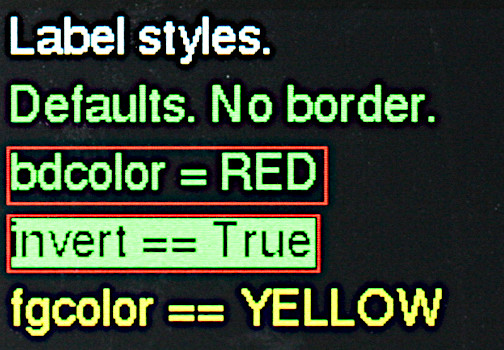

Various styles of `Label`.

The purpose of a `Label` instance is to display text at a specific screen
location.

Text can be static or dynamic. In the case of dynamic text the background is
cleared to ensure that short strings cleanly replace longer ones.

Labels can be displayed with an optional single pixel border.

Colors are handled flexibly. By default the colors used are those of the
`Writer` instance, however they can be changed dynamically; this might be used
to warn of overrange or underrange values. The `color15.py` demo illustrates
this.

Constructor args:  
 1. `writer` The `Writer` instance (font and screen) to use.
 2. `row` Location on screen.
 3. `col`
 4. `text` If a string is passed it is displayed: typically used for static
 text. If an integer is passed it is interpreted as the maximum text length
 in pixels; typically obtained from `writer.stringlen('-99.99')`. Nothing is
 dsplayed until `.value()` is called. Intended for dynamic text fields.
 5. `invert=False` Display in inverted or normal style.
 6. `fgcolor=None` Color of foreground (the control itself). If `None` the
 `Writer` foreground default is used.
 7. `bgcolor=None` Background color of object. If `None` the `Writer` background
 default is used.
 8. `bdcolor=False` Color of border. If `False` no border will be drawn. If
 `None` the `fgcolor` will be used, otherwise a color may be passed. If a color
 is available, a border line will be drawn around the control.

The constructor displays the string at the required location.

Methods:  
 1. `value` Redraws the label. This takes the following args:
    * `text=None` The text to display. If `None` displays last value.
    * ` invert=False` If true, show inverse text.
    * `fgcolor=None` Foreground color: if `None` the `Writer` default is used.
    * `bgcolor=None` Background color, as per foreground.
    * `bdcolor=None` Border color. As per above except that if `False` is
    passed, no border is displayed. This clears a previously drawn border.  
 Returns the current text string.  

If populating a label would cause it to extend beyond the screen boundary a
warning is printed at the console. The label may appear at an unexpected place.
The following is a complete "Hello world" script.
```python
from hardware_setup import ssd  # Create a display instance
from gui.core.ugui import Screen
from gui.core.writer import CWriter
from gui.core.colors import *

from gui.widgets.label import Label
from gui.widgets.buttons import CloseButton
import gui.fonts.freesans20 as freesans20


class BaseScreen(Screen):

    def __init__(self):
        super().__init__()
        wri = CWriter(ssd, freesans20, GREEN, BLACK, verbose=False)
        Label(wri, 2, 2, 'Hello world!')
        CloseButton(wri)

Screen.change(BaseScreen)
```

###### [Contents](./README.md#0-contents)

# 7. LED widget

```python
from gui.widgets.led import LED
```
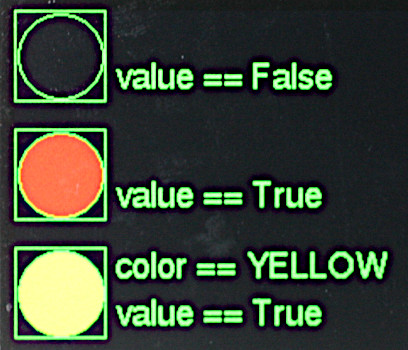

This is a virtual LED whose color may be altered dynamically. An `LED` may be
defined with a color and turned on or off by setting `.value` to a boolean. For
more flexibility the `.color` method may be use to set it to any color.

Constructor mandatory positional args:  
 1. `writer` The `Writer` instance (defines font) to use.
 2. `row` Location on screen.
 3. `col`  

Keyword only args:

 * `height=12` Height of LED.
 * `fgcolor=None` Color of foreground (the control itself). If `None` the
 `Writer` foreground default is used.
 * `bgcolor=None` Background color of object. If `None` the `Writer` background
 default is used.
 * `bdcolor=False` Color of border. If `False` no border will be drawn. If a
 color is provided, a border line will be drawn around the control.
 shown in the foreground color. If a color is passed, it is used.
 * `label=None`  A text string will cause a `Label` to be drawn below the
 LED. An integer will create a `Label` of that width for later use.

Methods:
 1. `color` arg `c=None` Change the LED color to `c`. If `c` is `None` the LED
 is turned off (rendered in the background color).
 2. `text` Updates the label if present (otherwise throws a `ValueError`). Args:
    * `text=None` The text to display. If `None` displays last value.
    * ` invert=False` If true, show inverse text.
    * `fgcolor=None` Foreground color: if `None` the `Writer` default is used.
    * `bgcolor=None` Background color, as per foreground.
    * `bdcolor=None` Border color. As per above except that if `False` is
    passed, no border is displayed. This clears a previously drawn border.  

###### [Contents](./README.md#0-contents)

# 8. Checkbox widget

```python
from gui.widgets.checkbox import Checkbox
```
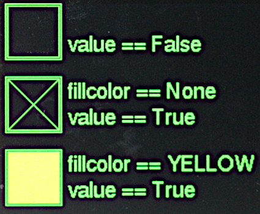  
This provides for Boolean data entry and display. In the `True` state the
control can show an 'X' or a filled block of any color depending on the
`fillcolor` constructor arg.

Constructor mandatory positional args:  
 1. `writer` The `Writer` instance (defines font) to use.
 2. `row` Location on screen.
 3. `col`  

Optional keyword only arguments:
 * `height=30` Dimension of the square bounding box. Default 30 pixels.
 * `fillcolor=None` Fill color of checkbox when `True`. If `None` an 'X' will
 be drawn.
 * `fgcolor=None` Color of foreground (the control itself). If `None` the
 `Writer` foreground default is used.
 * `bgcolor=None` Background color of object. If `None` the `Writer` background
 default is used.
 * `bdcolor=False` Color of border. If `False` no border will be drawn. If a
 color is provided, a border line will be drawn around the control.
 * `callback=dolittle` Callback function which will run when the value changes.
 The default is a null function.
 * `args=[]` A list/tuple of arguments for above callback.
 * `value=False` Initial value.
 * `active=True` By default user input is accepted.

Methods:
 * `greyed_out` Optional Boolean argument `val=None`. If `None` returns the
 current 'greyed out' status of the control. Otherwise enables or disables it,
 showing it in its new state.
 * `value` Optional Boolean argument `val`. If the provided value does not
 correspond to the control's current value, updates it; the checkbox is
 re-drawn and the callback executed. Always returns the control's value.

###### [Contents](./README.md#0-contents)

# 9. Button and CloseButton widgets

```python
from gui.core.colors import *  # Colors and shapes
from gui.widgets.buttons import Button
```
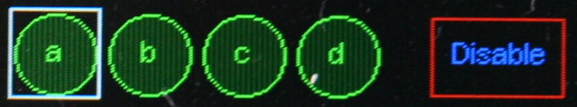

In this image `Button` "a" has the focus. Pressing the physical `select` button
will press the virtual `Button`.

This emulates a pushbutton, with a callback being executed each time the button
is pressed. Physically this consists of pressing the `select` button when the
`Button` instance has focus. Buttons may be any one of three shapes: `CIRCLE`,
`RECTANGLE` or `CLIPPED_RECT`.

Constructor mandatory positional args:  
 1. `writer` The `Writer` instance (defines font) to use.
 2. `row` Location on screen.
 3. `col`  

Optional keyword only arguments:
 * `shape=RECTANGLE` Must be `CIRCLE`, `RECTANGLE` or `CLIPPED_RECT`.
 * `height=20` Height of the bounding box.
 * `width=50` Width of the bounding box.
 * `fgcolor=None` Color of foreground (the control itself). If `None` the
 `Writer` foreground default is used.
 * `bgcolor=None` Background color of object. If `None` the `Writer` background
 default is used.
 * `bdcolor=False` Color of border. If `False` no border will be drawn. If a
 color is provided, a border line will be drawn around the control.
 * `textcolor=None` Text color. Defaults to `fgcolor`.
 * `litcolor=None` If provided the button will display this color for one
 second after being pressed.
 * `text=''` Shown in centre of button.
 * `callback=dolittle` Callback function which runs when button is pressed.
 * `args=()` A list/tuple of arguments for the above callback.
 * `onrelease=False` If `True` the callback will occur when the `select`
 pushbutton is released otherwise it will occur when pressed.

Method:
 * `greyed_out` Optional Boolean argument `val=None`. If `None` returns the
 current 'greyed out' status of the control. Otherwise enables or disables it,
 showing it in its new state.

Class variable:
 * `lit_time=1` Period in seconds the `litcolor` is displayed.

### CloseButton
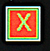  
This example has focus, as shown by white border.

This `Button` subclass is a special case of a Button. Its constructor takes a
single arg, being a `Writer` instance. It produces a red "X" button at the top
right hand corner of the current `Screen`. Operating it causes the screen to
close, with the screen below being revealed. On the bottom level screen, a
`CloseButton` will shut down the application.

Constructor mandatory positional arg:  
 * writer

Optional keyword only arguments:  
 * `width=0` By default dimensions are calculated from font size. The button is
 is square. Optionally `width` may be specified.
 * `callback=dolittle` Optional callback, not normally required.
 * `args=()` Args for above.
 * `bgcolor=RED`

###### [Contents](./README.md#0-contents)

# 10. ButtonList object

```python
from gui.core.colors import *  # Colors and shapes
from gui.widgets.buttons import Button, ButtonList
```

A `ButtonList` groups a number of buttons together to implement a button which
changes state each time it is pressed. For example it might toggle between a
green Start button and a red Stop button. The buttons are defined and added in
turn to the `ButtonList` object. Typically they will be the same size, shape
and location but will differ in color and/or text. At any time just one of the
buttons will be visible, initially the first to be added to the object.

Buttons in a `ButtonList` should not have callbacks. The `ButtonList` has
its own user supplied callback which runs each time the object is pressed.
However each button can have its own list of `args`. Callback arguments
comprise the currently visible button followed by its arguments.

Constructor argument:
 * `callback=dolittle` The callback function. Default does nothing.

Methods:
 * `add_button` Adds a button to the `ButtonList`. Arguments: as per the
 `Button` constructor.
 Returns the button object.
 * `greyed_out` Optional Boolean argument `val=None`. If `None` returns the
 current 'greyed out' status of the control. Otherwise enables or disables it,
 showing it in its new state.
 * `value` Optional args `button=None`, `new_cb=False`. The `button` arg, if
 provided, should be a button in the set. If supplied and the button is not
 active the currency changes to the supplied button, which is displayed. By
 default the callback of the previous button is run, otherwise the callback of
 the newly displayed button. 

Always returns the active button.

Counter intuitively, running the callback of the previous button is normal
behaviour. Consider a `ButtonList` consisting of ON and OFF buttons. If ON is
visible this implies that the machine under control is off. Pressing `select`
causes the ON callback to run, starting the machine. The new button displayed
now reads OFF.

Typical usage is as follows:
```python
def callback(button, arg):
    print(arg)

table = [
     {'fgcolor' : GREEN, 'shape' : CLIPPED_RECT, 'text' : 'Start', 'args' : ['Live']},
     {'fgcolor' : RED, 'shape' : CLIPPED_RECT, 'text' : 'Stop', 'args' : ['Die']},
]
bl = ButtonList(callback)
for t in table:  # Buttons overlay each other at same location
    bl.add_button(wri, 10, 10, textcolor = BLACK, **t)
```

###### [Contents](./README.md#0-contents)

# 11. RadioButtons object

```python
from gui.core.colors import *  # Colors and shapes
from gui.widgets.buttons import Button, RadioButtons
```
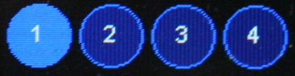

This object groups a set of buttons at different locations. When a button is
pressed, it becomes highlighted and remains so until another button in the set
is pressed. A callback runs each time the current button is changed.

Constructor positional arguments:
 * `highlight` Color to use for the highlighted button. Mandatory.
 * `callback` Callback when a new button is pressed. Default does nothing.
 * `selected` Index of initial button to be highlighted. Default 0.

Methods:
 * `add_button` Adds a button. Arguments: as per the `Button` constructor.
 Returns the Button instance.
 * `greyed_out` Optional Boolean argument `val=None`. If `None` returns the
 current 'greyed out' status of the control. Otherwise enables or disables it,
 showing it in its new state.
 * `value` Optional argument: a button in the set. If supplied, and the
 button is not currently active, the supplied button receives the focus and its
 callback is run. Always returns the currently active button.

Typical usage:
```python
def callback(button, arg):
    print(arg)

table = [
    {'text' : '1', 'args' : ['1']},
    {'text' : '2', 'args' : ['2']},
    {'text' : '3', 'args' : ['3']},
    {'text' : '4', 'args' : ['4']},
]
col = 0
rb = RadioButtons(callback, BLUE) # color of selected button
for t in table:
    rb.add_button(wri, 10, col, textcolor = WHITE,
                  fgcolor = LIGHTBLUE, height = 40, **t)
    col += 60 # Horizontal row of buttons
```

###### [Contents](./README.md#0-contents)

# 12. Listbox widget

```python
from gui.widgets.listbox import Listbox
```
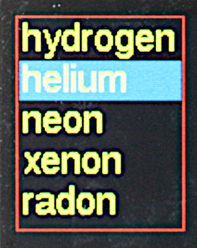

A `listbox` with the second item highlighted. Pressing the physical `select`
button will cause the callback to run.

A `Listbox` is an active widget. Its height is determined by the number of
entries in it and the font in use. Scrolling is not supported. When the widget
has focus the currently selected element may be changed using `increase` and
`decrease` buttons. On pressing `select` a callback runs.

Constructor mandatory positional args:  
 1. `writer` The `Writer` instance (defines font) to use.
 2. `row` Location on screen.
 3. `col`  

Mandatory keyword only argument:
 * `elements` A list or tuple of strings to display. Must have at least one
 entry.

Optional keyword only arguments:
 * `width=None` Control width in pixels. By default this is calculated to
 accommodate all elements.
 * `value=0` Index of currently selected list item.
 * `fgcolor=None` Color of foreground (the control itself). If `None` the
 `Writer` foreground default is used.
 * `bgcolor=None` Background color of object. If `None` the `Writer` background
 default is used.
 * `bdcolor=False` Color of border. If `False` no border will be drawn. If a
 color is provided, a border line will be drawn around the control.
 * `fontcolor=None` Text color. Defaults to system text color.
 * `select_color=DARKBLUE` Background color for selected item in list.
 * `callback=dolittle` Callback function which runs when `select` is pressed.
 * `args=[]` A list/tuple of arguments for above callback.
 * `also=0` Options are `Listbox.ON_MOVE` or `Listbox.ON_LEAVE`. By default the
 callback runs only when the `select` button is pressed. The `ON_LEAVE` value
 causes it also to run when the focus moves from the control if the currently
 selected element has changed. The `ON_MOVE` arg causes the callback to run
 every time the highlighted element is changed.

Methods:
 * `greyed_out` Optional Boolean argument `val=None`. If `None` returns the
 current 'greyed out' status of the control. Otherwise enables or disables it,
 showing it in its new state.
 * `value` Argument `val=None`. If a provided argument is a valid index for the list, that entry becomes current and the callback is executed. Always returns
 the index of the currently active entry.
 * `textvalue` Argument `text=None`. If a string argument is provided and is in
 the control's list, that item becomes current. Normally returns the current
 string. If a provided arg did not match any list item, the control's state is
 not changed and `None` is returned.

The callback's first argument is the listbox instance followed by any args
specified to the constructor. The currently selected item may be retrieved by
means of the instance's `value` or `textvalue` methods.

###### [Contents](./README.md#0-contents)

# 13. Dropdown widget

```python
from gui.widgets.dropdown import Dropdown
```

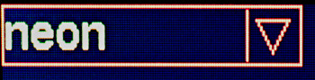

Closed dropdown list.

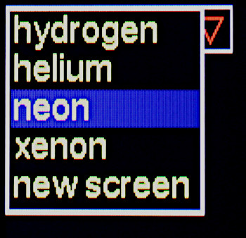

Open dropdown list. When closed, hidden items below are refreshed.

A dropdown list. The list, when active, is drawn below the control. The height
of the control is determined by the height of the font in use. The height of
the list is determined by the number of entries in it and the font in use.
Scrolling is not supported. The dropdown should be placed high enough on the
screen to ensure that the list can be displayed

Constructor mandatory positional args:  
 1. `writer` The `Writer` instance (defines font) to use.
 2. `row` Location on screen.
 3. `col`  

Mandatory keyword only argument:
 * `elements` A list or tuple of strings to display. Must have at least one
 entry.

Optional keyword only arguments:
 * `width=None` Control width in pixels. By default this is calculated to
 accommodate all elements.
 * `value=0` Index of currently selected list item.
 * `fgcolor=None` Color of foreground (the control itself). If `None` the
 `Writer` foreground default is used.
 * `bgcolor=None` Background color of object. If `None` the `Writer` background
 default is used.
 * `bdcolor=False` Color of border. If `False` no border will be drawn. If a
 color is provided, a border line will be drawn around the control.
 * `fontcolor=None` Text color. Defaults to foreground color.
 * `select_color=DARKBLUE` Background color for selected item in list.
 * `callback=dolittle` Callback function which runs when a list entry is picked.
 * `args=[]` A list/tuple of arguments for above callback.

Methods:
 * `greyed_out` Optional Boolean argument `val=None`. If `None` returns the
 current 'greyed out' status of the control. Otherwise enables or disables it,
 showing it in its new state.
 * `value` Argument `val=None`. If a provided arg is a valid index into the
 list, that entry becomes current and the callback is executed. Always returns
 the index of the currently active entry.
 * `textvalue` Argument `text=None`. If a string argument is provided and is in
 the control's list, that item becomes current. Normally returns the current
 string. If a provided arg did not match any list item, the control's state is
 not changed and `None` is returned.

If `select` is pressed when the `Dropdown` has focus, the list is displayed.
The `increase` and `decrease` buttons move the list currency. If `select` is
pressed after changing the currency the callback is triggered, the list is
closed and the control will display the newly selected entry. If `next` or
`prev` are pressed while the list is open, focus will move to the next widget.
In this event the list will close and no selection change will be recognised:
the control will show the element which was visible at the start and the
callback will not run. Moving the focus is a means of cancelling any changes.

The callback's first argument is the dropdown instance followed by any args
specified to the constructor. The currently selected item may be retrieved by
means of the instance's `value` or `textvalue` methods.

###### [Contents](./README.md#0-contents)

# 14. DialogBox class

```python
from gui.widgets.dialog import DialogBox
```
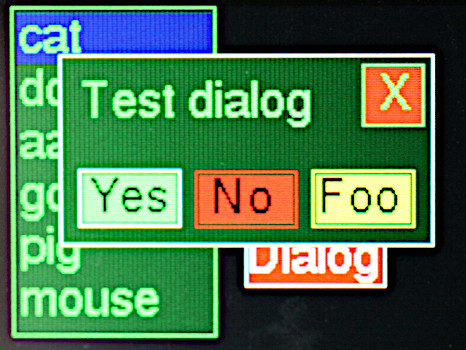

An active dialog box. Auto generated dialogs contain only `pushbutton`
instances, but user created dialogs may contain any widget. 

This implements a modal dialog box based on a horizontal row of pushbuttons.
Any button press will close the dialog. The caller can determine which button
was pressed. The size of the buttons and the width of the dialog box are
calculated from the strings assigned to the buttons. This ensures that buttons
are evenly spaced and identically sized. Typically used for simple queries such
as "yes/no/cancel".

Constructor positional args:  
 1. `writer` The `Writer` instance (defines font) to use.
 2. `row=20` Location on screen.
 3. `col=20`  

Mandatory keyword only arg:  
 * `elements` A list or tuple of 2-tuples. Each defines the text and color of
 a pushbutton, e.g. `(('Yes', RED), ('No', GREEN))`.

Optional keyword only args:  
 * `label=None` Text for an optional label displayed in the centre of the
 dialog box.
 * `bgcolor=DARKGREEN` Background color of window.
 * `buttonwidth=25` Minimum width of buttons. In general button dimensions are
 calculated from the size of the strings in `elements`.
 * `closebutton=True` If set, a `close` button will be displayed at the top RH
 corner of the dialog box.
 * `callback=dolittle`
 * `args=[]`

Classmethod (inherited from `Screen`):  
 * `value(cls, val=None)` The `val` arg can be any Python type.

The `DialogBox` is a `Screen` subclass. Pressing any button closes the dialog
and sets the `Screen` value to the text of the button pressed or "Close" in the
case of the `close` button. The outcome can therefore be tested by running
`Screen.value()` or by implementing the callback. The latter receives the
`DialogBox` instance as a first arg, followed by any args supplied to the
constructor.

Note that dialog boxes can also be constructed manually, enabling more flexible
designs. For example these might have widgets other than pushbuttons. The
approach is to write a user subclass of `Window`. Example code may be found
in `gui/demos/screens.py`.

###### [Contents](./README.md#0-contents)

# 15. Textbox widget

```python
from gui.widgets.textbox import Textbox
```
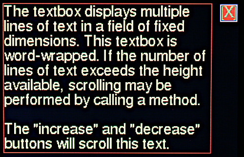

Displays multiple lines of text in a field of fixed dimensions. Text may be
clipped to the width of the control or may be word-wrapped. If the number of
lines of text exceeds the height available, scrolling will occur. Access to
text that has scrolled out of view may be achieved by calling a method. If the
widget is instantiated as `active` scrolling may be performed using the
`increase` and `decrease` buttons. The widget supports fixed and variable pitch
fonts.

Constructor mandatory positional arguments:
 1. `writer` The `Writer` instance (font and screen) to use.
 2. `row` Location on screen.
 3. `col`
 4. `width` Width of the object in pixels.
 5. `nlines` Number of lines of text to display. The object's height is
 determined from the height of the font:  
 `height in pixels = nlines*font_height`  
 As per all widgets the border is drawn two pixels beyond the control's
 boundary.

Keyword only arguments:
 * `fgcolor=None` Color of foreground (the control itself). If `None` the
 `Writer` foreground default is used.
 * `bgcolor=None` Background color of object. If `None` the `Writer` background
 default is used.
 * `bdcolor=False` Color of border. If `False` no border will be drawn. If a
 color is provided, a border line will be drawn around the control.
 * `clip=True` By default lines too long to display are right clipped. If
 `False` is passed, word-wrap is attempted. If the line contains no spaces
 it will be wrapped at the right edge of the window.
 * `active=False` If `True` scrolling may be performed via the `increase` and
 `decrease` buttons.

Methods:
 * `append` Args `s, ntrim=None, line=None` Append the string `s` to the
 display and scroll up as required to show it. By default only the number of
 lines which will fit on screen are retained. If an integer `ntrim=N` is
 passed, only the last N lines are retained; `ntrim` may be greater than can be
 shown in the control, hidden lines being accessed by scrolling.  
 If an integer (typically 0) is passed in `line` the display will scroll to
 show that line.
 * `scroll` Arg `n` Number of lines to scroll. A negative number scrolls up. If
 scrolling would achieve nothing because there are no extra lines to display,
 nothing will happen. Returns `True` if scrolling occurred, otherwise `False`.
 * `value` No args. Returns the number of lines of text stored in the widget.
 * `clear` No args. Clears all lines from the widget and refreshes the display.
 * `goto` Arg `line=None` Fast scroll to a line. By default shows the end of
 the text. 0 shows the start.

Fast updates:  
Rendering text to the screen is relatively slow. To send a large amount of text
the fastest way is to perform a single `append`. Text may contain newline
(`'\n'`) characters as required. In that way rendering occurs once only.

`ntrim`__
If text is regularly appended to a `Textbox` its buffer grows, using RAM. The
value of `ntrim` sets a limit to the number of lines which are retained, with
the oldest (topmost) being discarded as required.

###### [Contents](./README.md#0-contents)

# 16. Meter widget

```python
from gui.widgets.meter import Meter
```
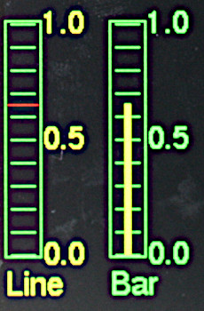

The two styles of `meter`, both showing a value of 0.65. This `passive` widget
provides a vertical linear meter display of values scaled between 0.0 and 1.0.

Constructor mandatory positional args:  
 1. `writer` The `Writer` instance (defines font) to use.
 2. `row` Location on screen.
 3. `col`  

Keyword only args:  
 * `height=50` Height of meter.
 * `width=10` Width.
 * `fgcolor=None` Color of foreground (the control itself). If `None` the
 `Writer` foreground default is used.
 * `bgcolor=BLACK` Background color of meter. If `None` the `Writer` background
 is used.
 * `bdcolor=False` Color of border. If `False` no border will be drawn. If a
 color is provided, a border line will be drawn around the control.
 * `ptcolor=None` Color of meter pointer or bar. Default is foreground color.
 * `divisions=5` No. of graduations to show.
 * `label=None` A text string will cause a `Label` to be drawn below the
 meter. An integer will create a `Label` of that width for later use.
 * `style=Meter.LINE` The pointer is a horizontal line. `Meter.BAR` causes a
 vertical bar to be displayed. Much easier to read on monochrome displays.
 * `legends=None` If a tuple of strings is passed, `Label` instances will be
 displayed to  the right hand side of the meter, starting at the bottom. E.G.
 `('0.0', '0.5', '1.0')`
 * `value=0` Initial value.
 
Methods:
 1. `value` Args: `n=None, color=None`.
    * `n` should be a float in range 0 to 1.0. Causes the meter to be updated.
    Out of range values are constrained. If `None` is passed the meter is not
    updated.
    * `color` Updates the color of the bar or line if a value is also passed.
    `None` causes no change.  
 Returns the current value.  
 2. `text` Updates the label if present (otherwise throws a `ValueError`). Args:
    * `text=None` The text to display. If `None` displays last value.
    * ` invert=False` If true, show inverse text.
    * `fgcolor=None` Foreground color: if `None` the `Writer` default is used.
    * `bgcolor=None` Background color, as per foreground.
    * `bdcolor=None` Border color. As per above except that if `False` is
    passed, no border is displayed. This clears a previously drawn border.  

###### [Contents](./README.md#0-contents)

# 17. Slider and HorizSlider widgets

```python
from gui.widgets.sliders import Slider, HorizSlider
```
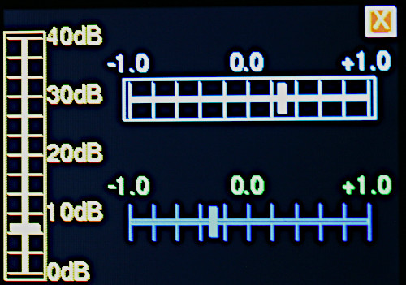

Different styles of slider.

These emulate linear potentiometers in order to display or control floating
point values. A description of the user interface in the `active` case may be
found in [Floating Point Widgets](./README.md#112-floating-point-widgets).

Vertical `Slider` and horizontal `HorizSlider` variants are available. These
are constructed and used similarly. The short forms (v) or (h) are used below
to identify these variants.

Constructor mandatory positional args:  
 1. `writer` The `Writer` instance (defines font) to use.
 2. `row` Location on screen.
 3. `col`  

Optional keyword only arguments:
 * `height` Dimension of the bounding box. Default 100 pixels (v), 20 (h).
 * `width` Dimension of the bounding box. Default 20 pixels (v), 100 (h).
 * `divisions=10` Number of graduations on the scale.
 * `legends=None` A tuple of strings to display near the slider. These will be
 distributed evenly along its length, starting at the bottom (v) or left (h).
 * `fgcolor=None` Color of foreground (the control itself). If `None` the
 `Writer` foreground default is used.
 * `bgcolor=None` Background color of object. If `None` the `Writer` background
 default is used.
 * `fontcolor=None` Text color. Defaults to foreground color.
 * `bdcolor=False` Color of border. If `False` no border will be drawn. If a
 color is provided, a border line will be drawn around the control.
 * `slotcolor=None` Color for the slot: this is a thin rectangular region in
 the centre of the control along which the slider moves. Defaults to the
 background color.
 * `prcolor=None` If `active`, in precision mode the white focus border changes
 to yellow to for a visual indication. An alternative color can be provided. 
 `WHITE` will defeat this change.
 * `callback=dolittle` Callback function which runs whenever the control's
 value changes. If the control is `active` it also runs on instantiation. This
 enables dynamic color changes. Default is a null function.
 * `args=[]` A list/tuple of arguments for above callback.
 * `value=0.0` The initial value: slider will be at the bottom (v), left (h).
 * `active=True` Determines whether the control can accept user input.

Methods:
 * `greyed_out` Optional Boolean argument `val=None`. If `None` returns the
 current 'greyed out' status of the control. Otherwise enables or disables it,
 showing it in its new state.
 * `value=None` Optional float argument. If supplied the slider moves to show
 the new value and the callback is triggered. The method constrains the range
 to 0.0 to 1.0. The method always returns the control's value.
 * `color` Mandatory arg `color` The control is rendered in the selected
 color. This supports dynamic color changes.

If instantiated as `active`, the floating point widget behaves as per
[section 1.12](./README.md#112-floating-point-widgets). When the widget has
focus, `increase` and `decrease` buttons adjust the value. Brief presses cause
small changes, longer presses cause accelerating change. A long press of
`select` invokes high precision mode.

### Callback

The callback receives an initial arg being the widget instance followed by any
user supplied args. The callback can be a bound method, typically of a `Screen`
subclass. The callback runs when the widget is instantiated and whenever the
value changes. This enables dynamic color change. See `gui/demos/active.py`.

###### [Contents](./README.md#0-contents)

# 18. Scale widget

```python
from gui.widgets.scale import Scale
```
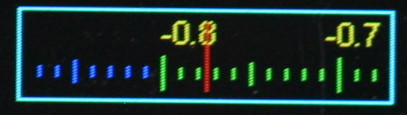

This displays floating point data having a wide dynamic range, and optionally
provides for user input of such values. It is modelled on old radios where a
large scale scrolls past a small window having a fixed pointer. This enables a
scale with (say) 200 graduations (ticks) to readily be visible on a small
display, with sufficient resolution to enable the user to interpolate between
ticks. Default settings enable estimation of a value to within about +-0.1%.

The `Scale` may be `active` or `passive`. A description of the user interface
in the `active` case may be found in
[Floating Point Widgets](./README.md#112-floating-point-widgets).

The scale handles floats in range `-1.0 <= V <= 1.0`, however data values may
be scaled to match any given range.

Legends for the scale are created dynamically as it scrolls past the window.
The user may control this by means of a callback. Example code may be found
[in nano-gui](https://github.com/peterhinch/micropython-nano-gui/blob/master/gui/demos/scale.py) which has a `Scale` whose value range is 88.0 to 108.0.
A callback ensures that the display legends match the user variable. A further
callback can enable the scale's color to change over its length or in response
to other circumstances.

Constructor mandatory positional args:  
 1. `writer` The `Writer` instance (defines font) to use.
 2. `row` Location on screen.
 3. `col`  

Optional keyword only arguments: 
 * `ticks=200` Number of "tick" divisions on scale. Must be divisible by 2.
 * `value=0.0` Initial value.
 * `height=0` Default is a minimum height based on the font height.
 * `width=100`
 * `fgcolor=None` Color of foreground (the control itself). If `None` the
 `Writer` foreground default is used.
 * `bgcolor=None` Background color of object. If `None` the `Writer` background
 default is used.
 * `bdcolor=None` Color of border, default `fgcolor`. If `False` no border will
 be drawn. If a  color is provided, a border line will be drawn around the
 control.
 * `prcolor=None` If `active`, in precision mode the white focus border changes
 to yellow to for a visual indication. An alternative color can be provided. 
 `WHITE` will defeat this change.
 * `pointercolor=None` Color of pointer. Defaults to `.fgcolor`.
 * `fontcolor=None` Color of legends. Default `fgcolor`.
 * `legendcb=None` Callback for populating scale legends (see below).
 * `tickcb=None` Callback for setting tick colors (see below).
 * `callback=dolittle` Callback function which runs when the user moves the
 scale or the value is changed programmatically. If the control is `active` it
 also runs on instantiation. Default is a null function.
 * `args=[]` A list/tuple of arguments for above callback.
 * `active=False` By default the widget is passive. By setting `active=True`
 the widget can acquire focus; its value can then be adjusted with the
 `increase` and `decrease` buttons.

Methods:
 * `greyed_out` Optional Boolean argument `val=None`. If `None` returns the
 current 'greyed out' status of the control. Otherwise enables or disables it,
 showing it in its new state.
 * `value=None` Set or get the current value. Always returns the current value.
 A passed `float` is constrained to the range -1.0 <= V <= 1.0 and becomes the
 `Scale`'s current value. The `Scale` is updated. Passing `None` enables
 reading the current value, but see note below on precision.

For example code see `gui/demos/active.py`.

### Control algorithm

If instantiated as `active`, the floating point widget behaves as per
[section 1.12](./README.md#112-floating-point-widgets). When the widget has
focus, `increase` and `decrease` buttons adjust the value. Brief presses cause
small changes, longer presses cause accelerating change. A long press of
`select` invokes high precision mode.

### Callback

The callback receives an initial arg being the widget instance followed by any
user supplied args. The callback can be a bound method, typically of a `Screen`
subclass. The callback runs when the widget is instantiated and whenever the
value changes. This enables dynamic color change.

### Callback legendcb

The display window contains 20 ticks comprising two divisions; by default a
division covers a range of 0.1. A division has a legend at the start and end
whose text is defined by the `legendcb` callback. If no user callback is
supplied, legends will be of the form `0.3`, `0.4` etc. User code may override
these to cope with cases where a user variable is mapped onto the control's
range. The callback takes a single `float` arg which is the value of the tick
(in range -1.0 <= v <= 1.0). It must return a text string. An example from
[ths nano-gui demo](https://github.com/peterhinch/micropython-nano-gui/blob/master/gui/demos/scale.py) shows FM radio frequencies:
```python
def legendcb(f):
    return '{:2.0f}'.format(88 + ((f + 1) / 2) * (108 - 88))
```
The above arithmetic aims to show the logic. It can (obviously) be simplified.

### Callback tickcb

This callback enables the tick color to be changed dynamically. For example a
scale might change from green to orange, then to red as it nears the extremes.
The callback takes two args, being the value of the tick (in range 
-1.0 <= v <= 1.0) and the default color. It must return a color. This example
is taken from the `scale.py` demo:
```python
def tickcb(f, c):
    if f > 0.8:
        return RED
    if f < -0.8:
        return BLUE
    return c
```

### Increasing the ticks value

This increases the precision of the display.

It does this by lengthening the scale while keeping the window the same size,
with 20 ticks displayed. If the scale becomes 10x longer, the value diference
between consecutive large ticks and legends is divided by 10. This means that
the `tickcb` callback must return a string having an additional significant
digit. If this is not done, consecutive legends will have the same value.

### Precision

For performance reasons the control stores values as integers. This means that
if you set `value` and subsequently retrieve it, there may be some loss of
precision. Each visible division on the control represents 10 integer units.

###### [Contents](./README.md#0-contents)

# 19. ScaleLog widget

```python
from gui.widgets.scale_log import ScaleLog
```
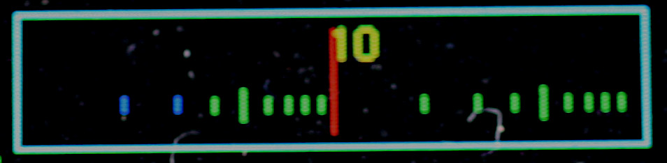

This displays floating point values with extremely wide dynamic range and
optionally enables their input. The dynamic range is handled by means of a base
10 logarithmic scale. In other respects the concept is that of the `Scale`
class.

The control is modelled on old radios where a large scale scrolls past a small
window having a fixed pointer. The use of a logarithmic scale enables the
value to span a range of multiple orders of magnitude.

The `Scale` may be `active` or `passive`. A description of the user interface
in the `active` case may be found in
[Floating Point Widgets](./README.md#112-floating-point-widgets). Owing to the
logarithmic nature of the widget, the changes discussed in that reference are
multiplicative rather than additive. Thus a long press of `increase` will
multiply the widget's value by a progressively larger factor, enabling many
decades to be traversed quickly.

Legends for the scale are created dynamically as it scrolls past the window,
with one legend for each decade. The user may control this by means of a
callback, for example to display units, e.g. `10MHz`. A further callback
enables the scale's color to change over its length or in response to other
circumstances.

The scale displays floats in range `1.0 <= V <= 10**decades` where `decades` is
a constructor arg. The user may readily scale these so that a control having a
range of 1-10,000 controls a user value from 1e-6 to 1e-2 while displaying
ticks labelled 1μs, 10μs, 100μs, 1ms and 10ms.

Constructor mandatory positional args:  
 1. `writer` The `Writer` instance (defines font) to use.
 2. `row` Location on screen.
 3. `col`  

Keyword only arguments (all optional): 
 * `decades=5` Defines the control's maximum value (i.e. `10**decades`).
 * `value=1.0` Initial value for control. Will be constrained to
 `1.0 <= value <= 10**decades` if outside this range.
 * `height=0` Default is a minimum height based on the font height.
 * `width=160`
 * `fgcolor=None` Color of foreground (the control itself). If `None` the
 `Writer` foreground default is used.
 * `bgcolor=None` Background color of object. If `None` the `Writer` background
 default is used.
 * `bdcolor=None` Color of border, default `fgcolor`. If `False` no border will
 be drawn. If a color is provided, a border line will be drawn around the
 control.
 * `prcolor=None` If `active`, in precision mode the white focus border changes
 to yellow to for a visual indication. An alternative color can be provided. 
 `WHITE` will defeat this change.
 * `pointercolor=None` Color of pointer. Defaults to `.fgcolor`.
 * `fontcolor=None` Color of legends. Default `WHITE`.
 * `legendcb=None` Callback for populating scale legends (see below).
 * `tickcb=None` Callback for setting tick colors (see below).
 * `callback=dolittle` Callback function which runs when the user moves the
 scale or the value is changed programmatically. If the control is `active` it
 also runs on instantiation. Default is a null function.
 * `args=[]` A list/tuple of arguments for above callback. The callback's
 arguments are the `ScaleLog` instance, followed by any user supplied args.
 * `delta=0.01` This determines the smallest amount of change which can be
 achieved with a brief button press. See Control Algorithm below.
 * `active=False` Determines whether the widget accepts user input.

Methods:
 * `value=None` Set or get the current value. Always returns the current value.
 A passed `float` is constrained to the range `1.0 <= V <= 10**decades` and
 becomes the control's current value. The `ScaleLog` is updated. Always returns
 the control's current value.
 * `greyed_out` Optional Boolean argument `val=None`. If `None` returns the
 current 'greyed out' status of the control. Otherwise enables or disables it,
 showing it in its new state.

For example code see `gui/demos/active.py`.

### Control algorithm

If instantiated as `active`, the floating point widget behaves as per
[section 1.12](./README.md#112-floating-point-widgets). When the widget has
focus, `increase` and `decrease` buttons adjust the value. Brief presses cause
small changes, longer presses cause accelerating change. A long press of
`select` invokes high precision mode.

In normal mode, the amount of change caused by a brief button press is
controlled by the constructor arg `delta`; the choice of this value represents
a compromise between precision and usability.

Owing to the logarithmic nature of the control, a small positive change is
defined by multiplication of the value by `(1 + delta)` and a negative change
corresponds to division by `(1 + delta)`. In precision mode `delta` is
reduced by a factor of 10.

### Callback

The callback receives an initial arg being the widget instance followed by any
user supplied args. The callback can be a bound method, typically of a `Screen`
subclass. The callback runs when the widget is instantiated and whenever the
value changes. This enables dynamic color change.

### Callback legendcb

The start of each decade is marked by a long "tick" with a user-definable text
label. By default it will display a number corresponding to the value at that
tick (of form `10**n` where `n` is an integer), but this can be overridden to
display values such as "10MHz". The following is a simple example from the
`scale_ctrl_test` demo:
```python
def legendcb(f):
    if f < 999:
        return '{:<1.0f}'.format(f)
    return '{:<1.0f}K'.format(f/1000)
```

### Callback tickcb

This callback enables the tick color to be changed dynamically. For example a
scale might change from green to orange, then to red as it nears the extremes.
The callback takes two args, being the value of the tick (of form `10**n` where
`n` is an integer) and the default color. It must return a color. This example
is taken from the `scale_ctrl_test` demo:
```python
def tickcb(f, c):
    if f > 30000:
        return RED
    if f < 10:
        return BLUE
    return c
```

###### [Contents](./README.md#0-contents)

# 20. Dial widget

```python
from gui.widgets.dial import Dial, Pointer
```
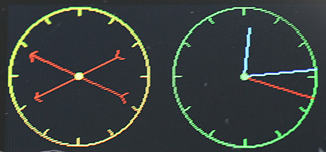  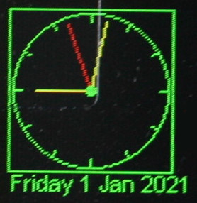

A `Dial` is a passive widget. It presents a circular display capable of
displaying an arbitrary number of vectors; each vector is represented by a
`Pointer` instance. The format of the display may be chosen to resemble an
analog clock or a compass. In the `CLOCK` case a pointer resembles a clock's
hand extending from the centre towards the periphery. In the `COMPASS` case
pointers are chevrons extending equally either side of the circle centre.

In both cases the length, angle and color of each `Pointer` may be changed
dynamically. A `Dial` can include an optional `Label` at the bottom which may
be used to display any required text.

In use, a `Dial` is instantiated. Then one or more `Pointer` objects are
instantiated and assigned to it. The `Pointer.value` method enables the `Dial`
to be updated affecting the length, angle and color of the `Pointer`.
Pointer values are complex numbers.

### Dial class

Constructor mandatory positional args:  
 1. `writer` The `Writer` instance (defines font) to use.
 2. `row` Location on screen.
 3. `col`  

Keyword only args:

 * `height=100` Height and width of dial.
 * `fgcolor=None` Color of foreground (the control itself). If `None` the
 `Writer` foreground default is used.
 * `bgcolor=None` Background color of object. If `None` the `Writer` background
 default is used.
 * `bdcolor=False` Color of border. If `False` no border will be drawn. If a
 color is provided, a border line will be drawn around the control.
 * `ticks=4` No. of gradutions to show.
 * `label=None` A text string will cause a `Label` to be drawn below the
 meter. An integer will create a `Label` of that width for later use.
 * `style=Dial.CLOCK` Pointers are drawn from the centre of the circle as per
 the hands of a clock. `Dial.COMPASS` causes pointers to be drawn as arrows
 centred on the control's centre. Arrow tail chevrons are suppressed for very
 short pointers.
 * `pip=None` Draws a central dot. A color may be passed, otherwise the
 foreground color will be used. If `False` is passed, no pip will be drawn. The
 pip is suppressed if the shortest pointer would be hard to see.

Method:

 1. `text` Updates the label if present (otherwise throws a `ValueError`). Args:
    * `text=None` The text to display. If `None` displays last value.
    * `invert=False` If true, show inverse text.
    * `fgcolor=None` Foreground color: if `None` the `Writer` default is used.
    * `bgcolor=None` Background color, as per foreground.
    * `bdcolor=None` Border color. As per above except that if `False` is
    passed, no border is displayed. This clears a previously drawn border.  

When a `Pointer` is instantiated it is assigned to the `Dial` by the `Pointer`
constructor.

### Pointer class

Constructor arg:
 1. `dial` The `Dial` instance on which it is to be dsplayed.

Methods:
 1. `value` Args:  
    * `v=None` The value is a complex number. A magnitude exceeding unity is
    reduced (preserving phase) to constrain the `Pointer` within the unit
    circle.
    * `color=None` By default the pointer is rendered in the foreground color
    of the parent `Dial`. Otherwise the passed color is used.  
    Returns the current value.

Typical usage:
```python
from hardware_setup import ssd  # Create a display instance
import uasyncio as asyncio
import cmath
from gui.core.ugui import Screen
from gui.core.writer import CWriter
from gui.core.colors import *

from gui.widgets.dial import Dial, Pointer
from gui.widgets.buttons import CloseButton
import gui.fonts.freesans20 as freesans20

async def run(dial):
    hrs = Pointer(dial)
    mins = Pointer(dial)
    hrs.value(0 + 0.7j, RED)
    mins.value(0 + 0.9j, YELLOW)
    dm = cmath.exp(-1j * cmath.pi / 30)  # Rotate by 1 minute
    dh = cmath.exp(-1j * cmath.pi / 1800)  # Rotate hours by 1 minute
    # Twiddle the hands: see vtest.py for an actual clock
    while True:
        await asyncio.sleep_ms(200)
        mins.value(mins.value() * dm, RED)
        hrs.value(hrs.value() * dh, YELLOW)

class BaseScreen(Screen):

    def __init__(self):
        super().__init__()
        wri = CWriter(ssd, freesans20, GREEN, BLACK, verbose=False)
        dial = Dial(wri, 5, 5, ticks = 12, bdcolor=None)
        self.reg_task(run(dial))
        CloseButton(wri)

Screen.change(BaseScreen)
```

###### [Contents](./README.md#0-contents)

# 21. Knob widget

```python
from gui.widgets.knob import Knob
```
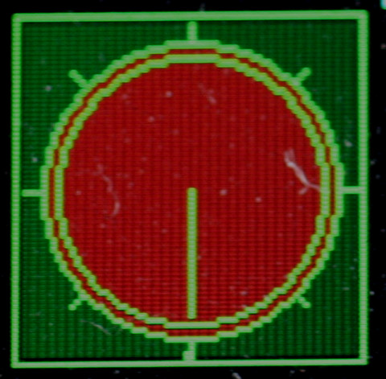

Rightmost example has no border and 270° travel. Others have 360°.

This emulates a rotary control capable of being rotated through a predefined
arc in order to display or set a floating point variable. A `Knob` may be
`active` or `passive`. A description of the user interface in the `active` case
may be found in [Floating Point Widgets](./README.md#112-floating-point-widgets).

Constructor mandatory positional args:  
 1. `writer` The `Writer` instance (defines font) to use.
 2. `row` Location on screen.
 3. `col`  

Optional keyword only arguments:
 * `height=70` Dimension of the square bounding box.
 * `arc=TWOPI` Movement available. Default 2*PI radians (360 degrees). May be
 reduced, e.g. to provide a 270° range of movement.
 * `ticks=9` Number of graduations around the dial.
 * `value=0.0` Initial value. By default the knob will be at its most
 counter-clockwise position.
 * `fgcolor=None` Color of foreground (the control itself). If `None` the
 `Writer` foreground default is used.
 * `bgcolor=None` Background color of object. If `None` the `Writer` background
 default is used.
 * `color=None` Fill color for the control knob. Default: no fill.
 * `bdcolor=False` Color of border. If `False` no border will be drawn. If a
 color is provided, a border line will be drawn around the control.
 * `prcolor=None` If `active`, in precision mode the white focus border changes
 to yellow to for a visual indication. An alternative color can be provided. 
 `WHITE` will defeat this change.
 * `callback=dolittle` Callback function runs when the user moves the knob or
 the value is changed programmatically.
 * `args=[]` A list/tuple of arguments for above callback.
 * `active=True` Enable user input via the `increase` and `decrease` buttons.

Methods:
 * `greyed_out` Optional Boolean argument `val=None`. If `None` returns the
 current 'greyed out' status of the control. Otherwise enables or disables it,
 showing it in its new state.
 * `value` Optional argument `val`. If set, adjusts the pointer to
 correspond to the new value. The move callback will run. The method constrains
 the range to 0.0 to 1.0. Always returns the control's value.

### Callback

The callback receives an initial arg being the widget instance followed by any
user supplied args. The callback can be a bound method, typically of a `Screen`
subclass. The callback runs when the widget is instantiated and whenever the
value changes. This enables dynamic color change.

###### [Contents](./README.md#0-contents)

# 22. Graph Plotting

```python
from gui.widgets.graph import PolarGraph, PolarCurve, CartesianGraph, Curve, TSequence
```
  

  

 Realtime time sequence simulation.

For example code see `gui/demos/plot.py`.

## 22.1 Concepts

Data for Cartesian graphs constitutes a sequence of x, y pairs, for polar
graphs it is a sequence of complex `z` values. The module supports three
common cases:  
 1. The dataset to be plotted is complete at the outset.
 2. Arbitrary data arrives gradually and needs to be plotted as it arrives.
 3. One or more `y` values arrive gradually. The `X` axis represents time. This
 is a simplifying case of 2.

### 22.1.1 Graph classes

A user program first instantiates a graph object (`PolarGraph` or
`CartesianGraph`). This creates an empty graph image upon which one or more
curves may be plotted. Graphs are passive widgets so cannot accept user input.

### 22.1.2 Curve classes

The user program then instantiates one or more curves (`Curve` or
`PolarCurve`) as appropriate to the graph. Curves may be assigned colors to
distinguish them.

A curve is plotted by means of a user defined `populate` generator. This
assigns points to the curve in the order in which they are to be plotted. The
curve will be displayed on the graph as a sequence of straight line segments
between successive points.

Where it is required to plot realtime data as it arrives, this is achieved
via calls to the curve's `point` method. If a prior point exists it causes a
line to be drawn connecting the point to the last one drawn.

### 22.1.3 Coordinates

`PolarGraph` and `CartesianGraph` objects are subclassed from `Widget` and are
positioned accordingly by `row` and `col` with a 2-pixel outside border. The
coordinate system within a graph conforms to normal mathematical conventions.

Scaling is provided on Cartesian curves enabling user defined ranges for x and
y values. Points lying outside of the defined range will produce lines which
are clipped at the graph boundary.

Points on polar curves are defined as Python `complex` types and should lie
within the unit circle. Points which are out of range may be plotted beyond the
unit circle but will be clipped to the rectangular graph boundary.

## 22.2 Graph classes

### 22.2.1 Class CartesianGraph

Constructor.  
Mandatory positional arguments:  
 1. `writer` A `CWriter` instance.
 2. `row` Position of the graph in screen coordinates.
 3. `col`

Keyword only arguments (all optional):  
 * `height=90` Dimension of the bounding box.
 * `width=110` Dimension of the bounding box.
 * `fgcolor=None` Color of the axis lines. Defaults to `Writer` foreground
 color.
 * `bgcolor=None` Background color of graph. Defaults to `Writer` background.
 * `bdcolor=None` Border color. If `False` no border is displayed. If `None` a
 border is shown in the foreground color. If a color is passed, it is used.
 * `gridcolor=None` Color of grid. Default: Writer foreground color.
 * `xdivs=10` Number of divisions (grid lines) on x axis.
 * `ydivs=10` Number of divisions on y axis.
 * `xorigin=5` Location of origin in terms of grid divisions.
 * `yorigin=5` As `xorigin`. The default of 5, 5 with 10 grid lines on each
 axis puts the origin at the centre of the graph. Settings of 0, 0 would be
 used to plot positive values only.

Method:  
 * `show` No args. Redraws the empty graph. Used when plotting time sequences.

### 22.2.2 Class PolarGraph

Constructor.  
Mandatory positional arguments:  
 1. `writer` A `CWriter` instance.
 2. `row` Position of the graph in screen coordinates.
 3. `col`

Keyword only arguments (all optional):  
 * `height=90` Dimension of the square bounding box.
 * `fgcolor=None` Color of the axis lines. Defaults to `Writer` foreground
 color.
 * `bgcolor=None` Background color of graph. Defaults to `Writer` background.
 * `bdcolor=None` Border color. If `False` no border is displayed. If `None` a
 border is shown in the `Writer` foreground color. If a color is passed, it is
 used.
 * `gridcolor=None` Color of grid. Default: Writer foreground color.
 * `adivs=3` Number of angle divisions per quadrant.
 * `rdivs=4` Number radius divisions.

Method:  
 * `show` No args. Redraws the empty graph.

## 22.3 Curve classes

### 22.3.1 class Curve

The Cartesian curve constructor takes the following positional arguments:

Mandatory arguments:
 1. `graph` The `CartesianGraph` instance.
 2. `color` If `None` is passed, the `graph` foreground color is used.

Optional arguments:  
 3. `populate=None` A generator to populate the curve. See below.   
 4. `origin=(0,0)` 2-tuple containing x and y values for the origin. Provides
 for an optional shift of the data's origin.  
 5. `excursion=(1,1)` 2-tuple containing scaling values for x and y.  

Methods:
 * `point` Arguments x, y. Defaults `None`. Adds a point to the curve. If a
 prior point exists a line will be drawn between it and the current point. If a
 point is out of range or if either arg is `None` no line will be drawn.
 Passing no args enables discontinuous curves to be plotted. This method is
 normally used for real time plotting.

The `populate` generator may take zero or more positional arguments. It should
repeatedly yield `x, y` values before returning. Where a curve is discontinuous
`None, None` may be yielded: this causes the line to stop. It is resumed when
the next valid `x, y` pair is yielded.

If `populate` is not provided the curve may be plotted by successive calls to
the `point` method. This may be of use where data points are acquired in real
time, and realtime plotting is required. See class `RTRect` in
`gui/demos/plot.py`.

#### Scaling

By default, with symmetrical axes, x and y values are assumed to lie between -1
and +1.

To plot x values from 1000 to 4000 we would set the `origin` x value to 1000
and the `excursion` x value to 3000. The `excursion` values scale the plotted
values to fit the corresponding axis.

### 22.3.2 class PolarCurve

The constructor takes the following positional arguments:

Mandatory arguments:
 1. `graph` The `PolarGraph` instance.
 2. `color`

Optional arguments:  
 3. `populate=None` A generator to populate the curve. See below.   

Methods:
 * `point` Argument `z=None`. Normally a `complex`. Adds a point
 to the curve. If a prior point exists a line will be drawn between it and the
 current point. If the arg is `None` no line  will be drawn. Passing no args
 enables discontinuous curves to be plotted. Lines are clipped at the square
 region bounded by (-1, -1) to (+1, +1).

The `populate` generator may take zero or more positional arguments. It should
yield a complex `z` value for each point before returning. Where a curve is
discontinuous a value of `None` may be yielded: this causes plotting to stop.
It is resumed when the next valid `z` point is yielded.

If `populate` is not provided the curve may be plotted by successive calls to
the `point` method. This may be of use where data points are acquired in real
time, and realtime plotting is required. See class `RTPolar` in
`gui/demos/plot.py`.

#### Scaling

Complex points should lie within the unit circle to be drawn within the grid.

## 22.4 class TSequence

A common task is the acquisition and plotting of real time data against time,
such as hourly temperature and air pressure readings. This class facilitates
this. Time is on the x-axis with the most recent data on the right. Older
points are plotted to the left until they reach the left hand edge when they
are discarded. This is akin to old fashioned pen plotters where the pen was at
the rightmost edge (corresponding to time now) with old values scrolling to the
left with the time axis in the conventional direction.

The user instantiates a graph with the X origin at the right hand side and then
instantiates one or more `TSequence` objects. As each set of data arrives it is
appended to its `TSequence` using the `add` method. See the example below.

The constructor takes the following args:

Mandatory arguments:
 1. `graph` The `CartesianGraph` instance.
 2. `color`
 3. `size` Integer. The number of time samples to be plotted. See below.

Optional arguments:  
 4. `yorigin=0` These args provide scaling of Y axis values as per the `Curve`
 class.
 5 `yexc=1`

Method:
 1. `add` Arg `v` the value to be plotted. This should lie between -1 and +1
 unless scaling is applied.

Note that there is little point in setting the `size` argument to a value
greater than the number of X-axis pixels on the graph. It will work but RAM
and execution time will be wasted: the constructor instantiates an array of
floats of this size.

Each time a data set arrives the graph should be cleared and a data value
is added to each `TSequence` instance. The following (slightly simplified) is
taken from `gui/demos/plot.py` and simulates the slow arrival of sinusoidal
values.

```python
class TSeq(Screen):
    def __init__(self):
        super().__init__()
        self.g = CartesianGraph(wri, 2, 2, xorigin = 10, fgcolor=GREEN,
                                gridcolor=LIGHTGREEN, bdcolor=False)

    def after_open(self):  # After graph has been drawn
        self.reg_task(self.run(self.g), True)  # Cancel on screen change

    async def run(self, g):
        await asyncio.sleep_ms(0)
        tsy = TSequence(g, YELLOW, 50)
        tsr = TSequence(g, RED, 50)
        t = 0
        while True:
            g.show()  # Redraw the empty graph
            tsy.add(0.9*math.sin(t/10))
            tsr.add(0.4*math.cos(t/10))  # Plot the new curves
            await asyncio.sleep_ms(400)
            t += 1
```

###### [Contents](./README.md#0-contents)

# Appendix 1 Application design

## Tab order and button layout

The "tab order" of widgets on a `Screen` is the order with which they acquire
focus with successive presses of the `Next` button. It is determined by the
order in which they are instantiated. 

The obvious layout for the physical buttons is as per a joystick:

|      |          |      |
|:----:|:--------:|:----:|
|      | Increase |      |
| Prev | Select   | Next |
|      | Decrease |      |

This works well with many screen layouts, if the tab order is considered in the
layout of the screen. It works well with most widgets including vertical ones
such as the `Slider`. With horizontal widgets such as `Scale` controls it can
be counter intuitive because the horizontal layout does not match the position
of the `increase` and `decrease` buttons. A different physical layout may be
preferred.

The apparently obvious solution of designing a vertical `Scale` is tricky owing
to the fact that the length of the internal text can be substantial and
variable.

## Use of graphics primitives

These notes are for those wishing to draw directly to the `Screen` instance.
This is done by providing the user `Screen` class with an `after_open()` method
which issues the display driver calls.

The following code instantiates two classes:
```python
from hardware_setup import display, ssd
```
The `ssd` object is an instance of the object defined in the display driver. It
is a requirement that this is a subclass of `framebuf.FrameBuffer`. Hence `ssd`
supports all the graphics primitives provided by `FrameBuffer`. These may be
used to draw on the `Screen`.

The `display` object has an `ssd` bound variable which is a reference to the
`ssd` device. The `display` has methods with the same names and args as those
of `ssd`. These support greying out. So you can write (for example)
```python
display.rect(10, 10, 50, 50, RED)
```
To render in the correct colors it is wise ensure that greying out is disabled
prior to calling `display` methods. This is done with
```python
display.usegrey(False)
```
There is little point in issuing `display.rect` as it confers no advantage over
`ssd.rect`. However the `Display` class adds methods not currently available in
`framebuf`. These are listed below.

 * `circle(self, x0, y0, r, color, width =1)` Width specifies the line width.
 * `fillcircle(self, x0, y0, r, color)`
 * `clip_rect(self, x, y, w, h, color)` Rectangle with clipped corners.
 * `fill_clip_rect(self, x, y, w, h, color)`
 * `print_left(self, writer, x, y, txt, fgcolor=None, bgcolor=None, invert=False)`
 * `print_centred(self, writer, x, y, text, fgcolor=None, bgcolor=None, invert=False)`

Hopefully these are self explanatory. The `Display` methods use the `framebuf`
convention of `x, y` coordinates rather than the `row, col` system used by
micro-gui.

